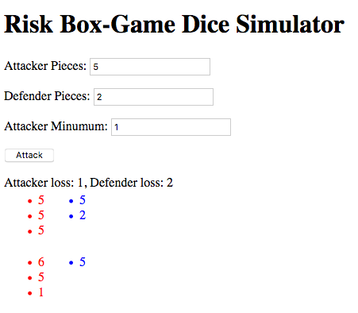

# Risk Attack Simulator
This is a simple `elm` experimental project to simulate rolling the dice again and again when playing Risk with friends.

Similar to : http://www.morningtoast.com/feature/risk/

Used mainly for educational purposes when learning `elm`

1. Attacker Pieces - Number of pieces in the attacking territory
1. Defendet Pieces - Number of pieces in the defending territory
1. Attacker Minimum - minimum number of pieces that has to remain in the attacker's origin territory

# Screenshot

